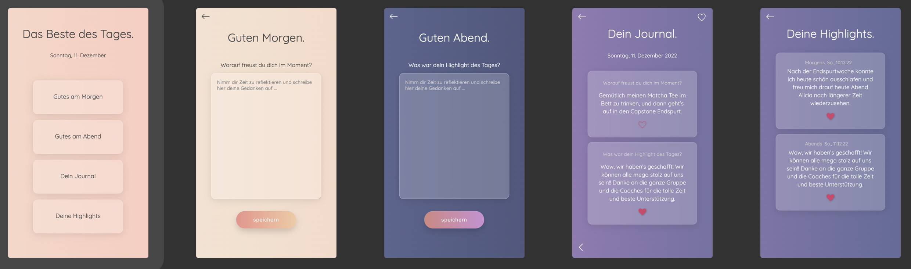

# My Capstone Project: Das Beste des Tages. / The Best of Your Day.

The App **Das Beste des Tages./The Best of Your Day.** helps to focus on the positive things on a daily basis. In the mornings you can reflect on what you're looking forward to today. In the evenings about what was your highlight during the day, what made you feel happy. The best feature is that you can treasure your chosen highlights, and that would be your feel good booster whenever you need one. It was made with Next.js.

This app was developed as my capstone project during the final four weeks of the neue fische Web Development Bootcamp in winter 2022.

**Please watch out: This app is optimized for mobile usage. Please switch your browser to responsive mode (iPhone SE/6/7/8).**

Take a look at the app [here on Vercel](https://das-beste-des-tages.vercel.app/) or watch the preview below.

---

## App Impressions



---

## Tech Stack

- React
- React Hooks
- Next.js
- Next.js Router
- Javascript
- Styled Components
- LocalStorage
- uuid
- Jest
- React Testing Library

---

<!-- This is a [Next.js](https://nextjs.org/) project bootstrapped with [`create-next-app`](https://github.com/vercel/next.js/tree/canary/packages/create-next-app).

## Getting Started

First, run the development server:

```bash
npm run dev
# or
yarn dev
```

Open [http://localhost:3000](http://localhost:3000) with your browser to see the result.

You can start editing the page by modifying `pages/index.js`. The page auto-updates as you edit the file.

[API routes](https://nextjs.org/docs/api-routes/introduction) can be accessed on [http://localhost:3000/api/hello](http://localhost:3000/api/hello). This endpoint can be edited in `pages/api/hello.js`.

The `pages/api` directory is mapped to `/api/*`. Files in this directory are treated as [API routes](https://nextjs.org/docs/api-routes/introduction) instead of React pages.

## Learn More

To learn more about Next.js, take a look at the following resources:

- [Next.js Documentation](https://nextjs.org/docs) - learn about Next.js features and API.
- [Learn Next.js](https://nextjs.org/learn) - an interactive Next.js tutorial.

You can check out [the Next.js GitHub repository](https://github.com/vercel/next.js/) - your feedback and contributions are welcome!

## Deploy on Vercel

The easiest way to deploy your Next.js app is to use the [Vercel Platform](https://vercel.com/new?utm_medium=default-template&filter=next.js&utm_source=create-next-app&utm_campaign=create-next-app-readme) from the creators of Next.js.

Check out our [Next.js deployment documentation](https://nextjs.org/docs/deployment) for more details. -->
